= Querying streams with SQL

NOTE: This lab assumes that the link:streaming_lite.adoc[From Edge to Streams Processing] lab has been completed.

In this workshop you will use SQL Stream Builder to query and manipulate data streams using SQL language. SQL Stream Builder is a powerful service that enables you to create Flink jobs without having to write Java/Scala code.

== Labs summary
* *Lab 0* - Preparation: Start Kafka Producer (only necessary if you start in an empty environment)
* *Lab 1* - Create a Data Source for IoT Topic
* *Lab 2* - Create a Source Virtual Table for the IoT topic with JSON messages
* *Lab 3* - Run a simple query
* *Lab 4* - Computing and storing aggregation results
* *Lab 5* - Create a Source Virtual Table for WeatherCondition topic in CSV format
* *Lab 6* - Join two Kafka topics
* *Lab 7* - Look up Reference data stored in Kudu
* *Lab 8* - Materialized Views

== Introduction

In this lab, and the subsequent ones, we will use the `iot` topic created and populated in previous labs and contains a datastream of computer performance data points. If you start in an empty environment do *Step 0* first

So let's start with a straightforward goal: to query the contents of the `iot` topic using SQL to examine the data that is being streamed.

Albeit simple, this task will show the ease of use and power of SQL Stream Builder (SSB).

[[lab_0, Lab 0]]
== Lab 0 - Create a Data Source for IoT Topic
. Open two SSH connections to your LAB environment via a browser or terminal
+
The details for the connection are available on the LAB environment overview page.
+
image::images/flink_ssl_lite.png[width=800]

. Use the first SSH connection to download a JAVA App which generates sample messages a publishing into Kafka `iot` topic
+
[source,shell]
----
sudo wget https://github.com/zBrainiac/streaming-flink/releases/download/0.4.1/streaming-flink-0.4.1.0.jar -P /opt/cloudera/parcels/FLINK/lib/flink/examples/streaming
----

. Switch directory and start JAVA App - parameters:
.. kafka-broker = edge2ai-1.dim.local:9092
.. 100 ms wait time between msg.
+
[source,shell]
----
cd /opt/cloudera/parcels/FLINK/lib/flink/examples/streaming
java -classpath streaming-flink-0.4.1.0.jar producer.KafkaIOTSensorSimulator edge2ai-1.dim.local:9092 100
----

[[lab_1, Lab 1]]
== Lab 1 - Create a Data Source for IoT Topic

Before we can start querying data from Kafka topics we need to register the Kafka clusters as _data sources_ in SSB.

. On the landing page or Cloudera Manager console, click on the Cloudera logo at the top-left corner to ensure you are at the home page and then click on the *SQL Stream Builder* service.

. Click on the *SQLStreamBuilder Console* link to open the SSB UI.

. On the logon screen, authenticate with user `admin` and password `supersecret1`

. Click on *Data Providers* you will notice that SSB already has a Kafka cluster registered as a data source, named `CDP Kafka`. This source is created automatically for SSB when it is installed on a cluster that also has a Kafka service:
+
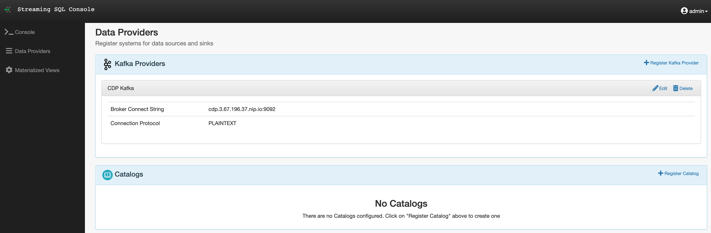

. You can use this screen to add other external Kafka clusters as data sources to SSB.

[[lab_2, Lab 2]]
== Lab 2 - Create a Source Virtual Table for a topic with JSON messages

Now we can _map_ the `iot` topic to a _virtual table_ that we can reference in our query. _Virtual Tables_ on SSB are a way to associate a Kafka topic with a schema so that we can use that as a table in our queries.

We will use a Source Virtual Table now to read from the topic. Later we will look into Sink Virtual Tables to write data to Kafka.

. To create our first Source Virtual Table, click on *Console* (on the left bar) *> Tables > Add table > Apache Kafka*.
+
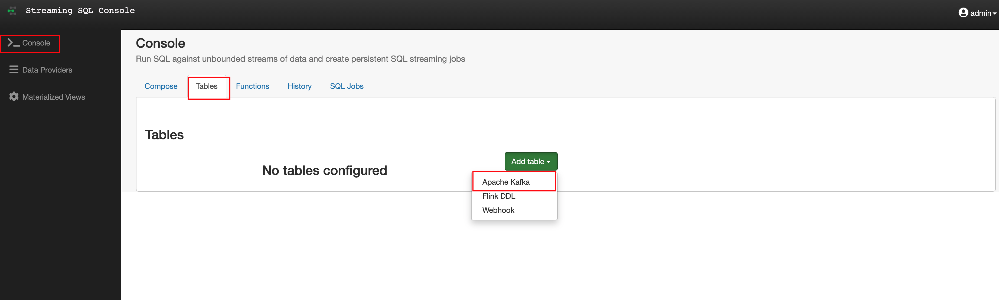

. On the *Kafka Source* window, enter the following information:
+
[source,yaml]
----
Virtual table name: iot_enriched_source
Kafka Cluster:      CDP Kafka
Topic Name:         iot
Data Format:        JSON
----
+
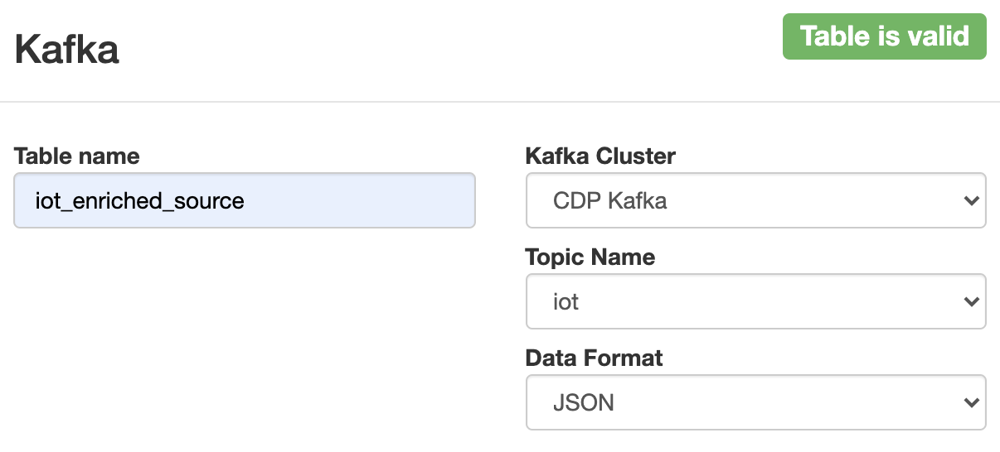

. Ensure the *Schema* tab is selected. Scroll to the bottom of the tab and click *Detect Schema*. SSB will take a sample of the data flowing through the topic and will infer the schema used to parse the content. Alternatively you could also specify the schema in this tab.
+

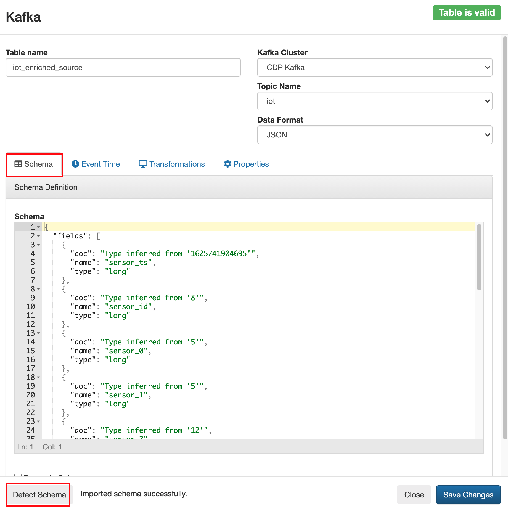

. Click on the *Event Time* tab, define your time handling. You can specify Watermark Definitions when adding a Kafka table. Watermarks use an event time attribute and have a watermark strategy, and can be used for various time-based operations. The *Event Time* tab provides the following properties to configure the event time field and watermark for the Kafka stream:

* *Input Timestamp* Column: name of the timestamp column in the Kafka table from where the event time column is mapped
* *Event Time* Column: new name of the timestamp column where the watermarks are going to be mapped
* *Watermark seconds* : number of seconds used in the watermark strategy. The watermark is defined by the current event timestamp minus this value.
+
[source,yaml]
----
Input Timestamp Column: sensor_ts
Event Time Column:      event_ts
Watermark Seconds:      3
----
+
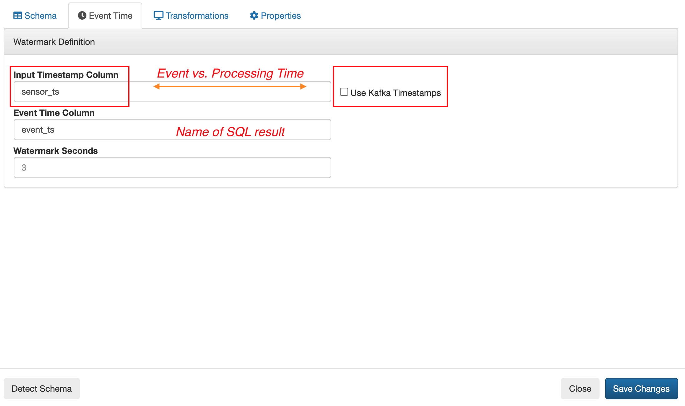
. If we need to manipulate the source data to fix, cleanse or convert some values, we can define *transformations* for the data source to perform those changes. These transformations are defined in Javascript.
+
The serialized record read from Kafka is provided to the Javascript code in the `record.value` variable. The last command of the transformation must return the serialized content of the modified record.
+
The data in the `iot_enriched` topic has a timestamp expressed in microseconds. Let's say we need the value in milliseconds. Let's write a transformation to perform that conversion for us at the source.
+
Click on the *Transformations* tab and enter the following code in the *Code* field:
+
[source,javascript]
----
// Kafka payload (record value JSON deserialized to JavaScript object)
var payload = JSON.parse(record.value);
payload['sensor_0'] = Math.round(payload.sensor_0 * 1000);
JSON.stringify(payload);
----
+
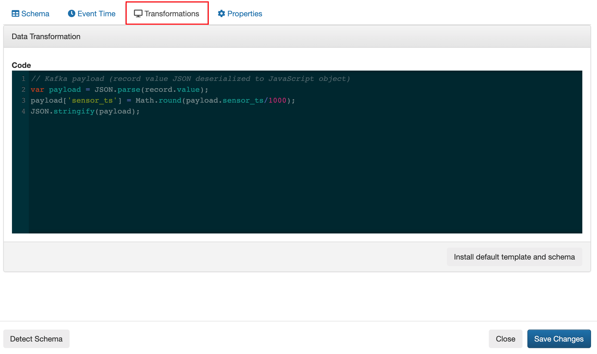
. Click on the *Properties* tab, enter the following value for the *Consumer Group* property and click *Save changes*.
+
[source,yaml]
----
Consumer Group: ssb-iot-1
----

+
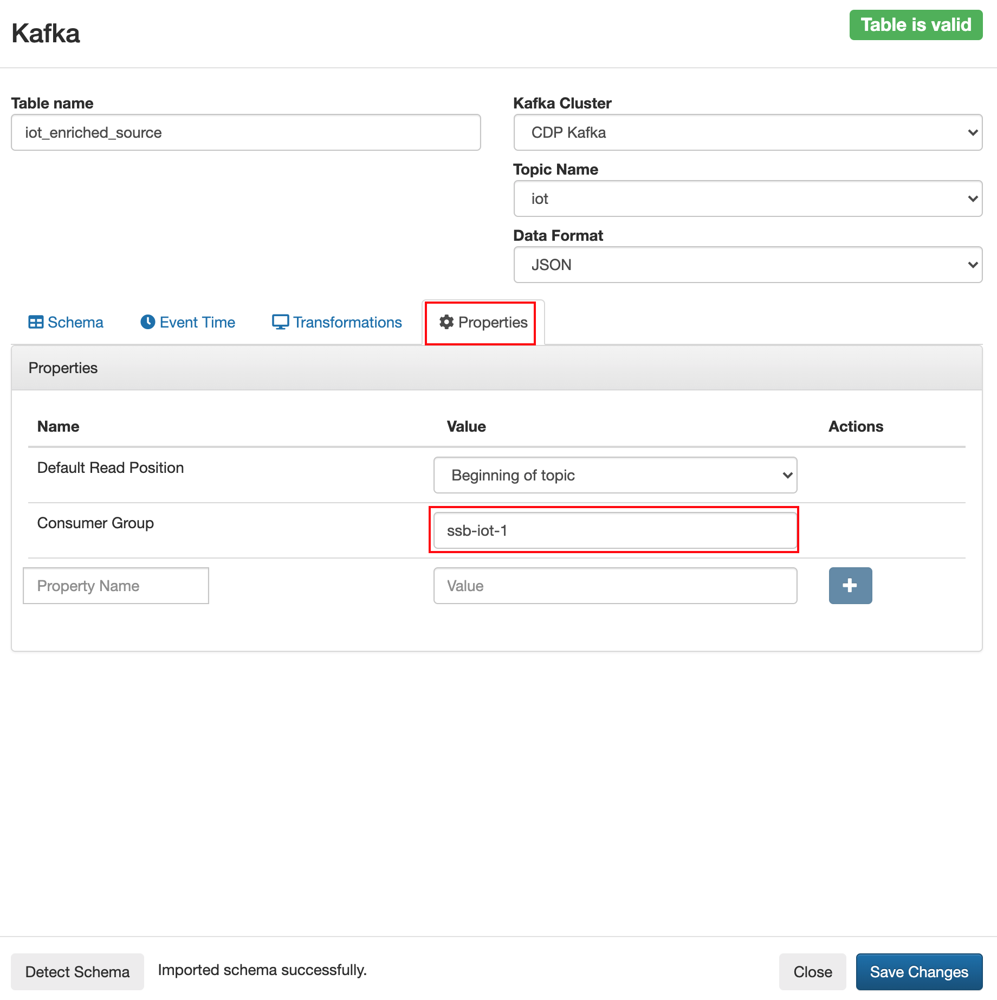
+
NOTE: Setting the *Consumer Group* properties for a virtual table will ensure that if you stop a query and restart it later, the second query execute will continue to read the data from the point where the first query stopped, without skipping data. *However*, if _multiple queries_ use the same virtual table, setting this property will effectively distribute the data across the queries so that each record is only read by a single query. If you want to share a virtual table with multiple distinct queries, ensure that the Consumer Group property is unset.

[[lab_3, Lab 3]]
== Lab 3 - Run a simple query

We have now all that we need to run our first query in SSB. We want to simply query the raw contents of topic to ensure that the everything is working correctly before we proceed to do more complex things.

If your environment is healthy and all the steps from previous labs were completed correctly you should be able to visualize the data with the steps below.

. On the SSB UI, click on *Console* (on the left bar) *> Compose > SQL* and type the following query:
+
[source,sql]
----
select *
from iot_enriched_source
----
+
image::images/ssb-compose-sql.png[width=800]

. Set a *SQL Job Name* for your job or use the random name provided.

. Do *not* add a Sink Virtual Table.

. Click *Execute*

. Scroll to the bottom of the page and you will see the log messages generated by your query execution.
+
image::images/ssb-sql-execution.png[width=800]

. After a few seconds the SQL Console will start showing the results of the query coming from the `iot` topic.
+
The data displayed on the screen is only a sample of the data returned by the query, not the full data. The column on the right shows the previously defined *Event Time*
+
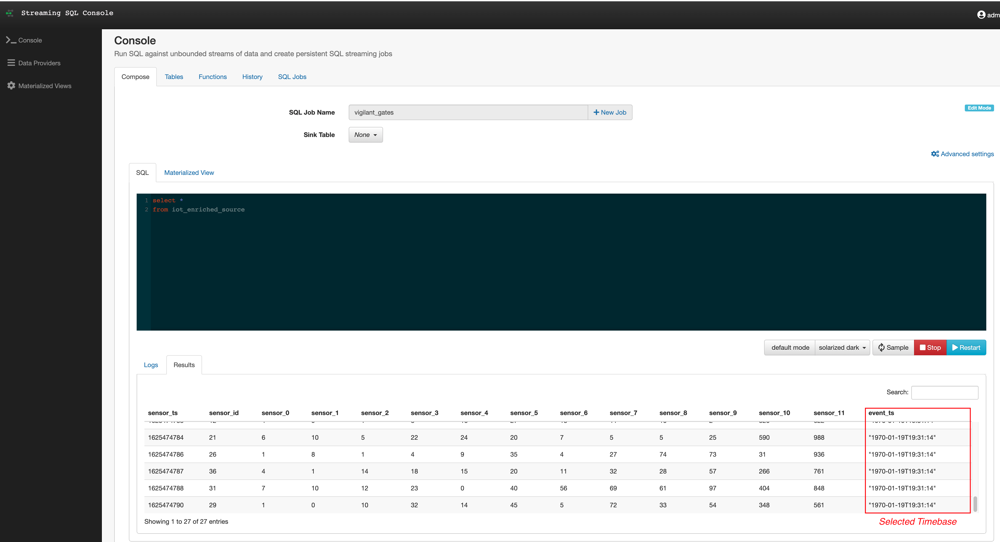
+
. *HELLO WORLD* in streaming - adjusted SQL by adding some *GROUP BY* and *COUNT*
+
[source,sql]
----
select sensor_id,
  count(*) as sensorCount
from iot_enriched_source
group by sensor_id
----
+
. After editing SQL - click on *Restart*
+

NOTE: Make sure to stop your queries to release all resources once you finish this lab. You can double-check that all queries/jobs have been stopped by clicking on the *SQL Jobs* tab. If any jobs are still running, you can stop them from that page.

[[lab_4, Lab 4]]
== Lab 4 - Computing and storing aggregation results

We want to start computing window aggregates for our incoming data stream and make the aggregation results available for downstream applications. SQL Stream Builder's Sink Virtual Tables give us the ability to publish/store streaming data to several different services (Kafka, AWS S3, Google GCS, Elastic Search and generic webhooks). In this lab we'll use a Kafka sink to publish the results of our aggregation to another Kafka topic.

. Let's first create a topic (`sensor6_stats`) where to publish our aggregation results:
.. Navigate to the SMM UI (*Cloudera Manager > SMM* service *>
Streams Messaging Manager Web UI*).
.. On the SMM UI, click the *Topics* tab (image:images/topics_icon.png[width=25]).
.. Click the *Add New* button.
.. Enter the following details for the topic and click *Save* when ready:
... Topic name: `sensor6_stats`
... Partitions: `10`
... Availability: `Low`
... Cleanup Policy: `delete`

. To create the Sink Virtual Table, click on *Console* (on the left bar) *> Tables > Add Table > Apache Kafka*.
+

. On the *Apache Kafka* window, enter the following information and click *Save changes*:
+
[source,yaml]
----
Virtual table name: sensor6_stats_sink
Kafka Cluster:      CDP Kafka
Topic Name:         sensor6_stats
Dynamic Schema:     YES
----
+
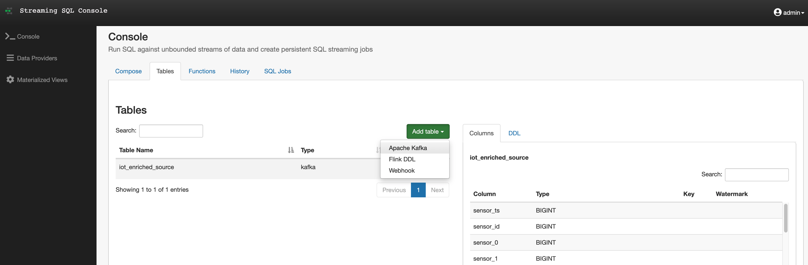

. On the SSB UI, click on *Console* (on the left bar) *> Compose > SQL* and type the query shown below.
+
This query will compute aggregates over 30-seconds windows that slide forward every second. For a specific sensor value in the record (`sensor_6`) it computes the following aggregations for each window:
+
--
* Number of events received
* Sum of the `sensor_6` value for all the events
* Average of the `sensor_6` value across all the events
* Min and max values of the `sensor_6` field
* Number of events for which the `sensor_6` value exceeds `70`
--
+
[source,sql]
----
SELECT
  sensor_id as device_id,
  HOP_END(event_ts, INTERVAL '1' SECOND, INTERVAL '30' SECOND) as windowEnd,
  count(*) as sensorCount,
  sum(sensor_6) as sensorSum,
  avg(cast(sensor_6 as float)) as sensorAverage,
  min(sensor_6) as sensorMin,
  max(sensor_6) as sensorMax,
  sum(case when sensor_6 > 70 then 1 else 0 end) as sensorGreaterThan60
FROM iot_enriched_source
GROUP BY
  sensor_id,
  HOP(event_ts, INTERVAL '1' SECOND, INTERVAL '30' SECOND)
----
+
image::images/ssb-sql-aggregation.png[width=800]

. Enter `Sensor6Stats` for the *SQL Job Name* field.

. On the *Sink Virtual Table* field, click on the *None* drop-down and select the Virtual Sink Table that you created previously (`sensor6_stats_sink`)
+
image::images/ssb-select-sink.png[width=800]

. Click *Execute*.

. Scroll to the bottom of the page and you will see the log messages generated by your query execution.
+
image::images/ssb-sql-execution.png[width=800]

. After a few seconds the SQL Console will start showing the results of your aggregation query.
+
Note that the data displayed on the screen is only a sample of the data returned by the query, not the full data.
+
image::images/ssb-sql-aggr-results.png[width=800]

. Check the job execution details and logs by clicking on *Console* (on the left bar) *> SQL Jobs* tab. Explore the options on this screen:
+
--
.. Click on the `Sensor6Stats` job.
.. Click on the *Details* tab to see job details.
.. Click on the *Log* tab to see log messages generated by the job execution.
--
+
image::images/ssb-job-details.png[width=800]

. Click on the *Flink Dashboard* link to open the job's page on the dashboard. Navigate the dashboard pages to explore details and metrics of the job execution.
+
image::images/ssb-job-dashboard.png[width=800]

. Let's query the `sensor6_stats` table to examine the data that is being written to it. First we need to define a Source Virtual Table associated with the `sensor6_stats` topic.
+
--
.. Click on *Console* (on the left bar) *> Virtual Tables > Source Virtual Table > Add Source > Apache Kafka*.
.. On the *Kafka Source* window, enter the following information and click *Save changes*:
+
[source,yaml]
----
Virtual table name: sensor6_stats_source
Kafka Cluster:      CDP Kafka
Topic Name:         sensor6_stats
Data Format:        JSON
----
--
.. Click on *Detect Schema* and wait for the schema to be updated.
.. Click *Save changes*.

. Click on *Console* (on the left bar) to refresh the screen and clear the SQL Compose field, which may still show the running aggregation job.
+
Note that the job will continue to run in the background and you can continue to monitor it through the *Job Logs* page.

. Enter the following query in the SQL field and execute it:
+
[source,sql]
----
SELECT *
FROM sensor6_stats_source
----

. After a few seconds you should see the contents of the `sensor6_stats` topic displayed on the screen:
+
image::images/ssb-stats-results.png[width=800]

. You will need to leave the `Sensor6Stats` job running to use it in the next lab. Make sure you stop all other jobs to release cluster resources.
+
image::images/ssb-jobs-running.png[width=800]

NOTE: Make sure to stop your queries to release all resources once you finish this lab. You can double-check that all queries/jobs have been stopped by clicking on the *SQL Jobs* tab. If any jobs are still running, you can stop them from that page.

[[lab_5, Lab 5]]
== Lab 5 - Create a Source Virtual Table for WeatherCondition topic in CSV format
. Let's got back to SSH and use the second session
. Switch directory and start JAVA App which publish messages in CSV format to the topic `kafka_LookupWeatherCondition`
+
[source,shell]
----
cd /opt/cloudera/parcels/FLINK/lib/flink/examples/streaming
java -classpath streaming-flink-0.4.1.0.jar producer.KafkaLookupWeatherCondition edge2ai-1.dim.local:9092
----
+
. Define new virtual table *weather_condition*. To create a new Source Table, click on *Console* (on the left bar) *>  Tables > Add Table > Add Source > Flink DDL*.

. On the *Flink DDL* window, enter the following information:

+
[source,sql]
----
CREATE TABLE weather_condition (
  stationid INT,
  eventDate STRING,
  tre200s0 DOUBLE,
  rre150z0 DOUBLE,
  sre000z0 DOUBLE,
  gre000z0 DOUBLE,
  ure200s0 DOUBLE,
  tde200s0 DOUBLE,
  dkl010z0 DOUBLE,
  fu3010z0 DOUBLE,
  fu3010z1 DOUBLE,
  prestas0 DOUBLE,
  pp0qffs0 DOUBLE,
  pp0qnhs0 DOUBLE,
  ppz850s0 DOUBLE,
  ppz700s0 DOUBLE,
  dv1towz0 DOUBLE,
  fu3towz0 DOUBLE,
  fu3towz1 DOUBLE,
  ta1tows0 DOUBLE,
  uretows0 DOUBLE,
  tdetows0 DOUBLE
) WITH (
 'connector' = 'kafka',
 'topic' = 'kafka_LookupWeatherCondition',
 'properties.bootstrap.servers' = 'edge2ai-1.dim.local:9092',
 'properties.group.id' = 'kafka_LookupWeatherCondition',
 'format' = 'csv',
 'csv.ignore-parse-errors' = 'true',
 'csv.allow-comments' = 'true'
)
----

[[lab_6, Lab 6]]
== Lab 6 - Join two Kafka topics

. Back to the Console
. Add SQL join statement between `IoT` and `WeatherCondition`

First let's check the data feeds

[source,sql]
----
select * from weather_condition
----

Update the SQL with some join statement
[source,sql]
----
select iot.sensor_id,
 sensor_0 as pressure,
 sensor_1 as torsion,
 tre200s0 as AirTemperature2m
from iot_enriched_source as iot,  weather_condition as weather
where iot.sensor_id = weather.stationid

/* or as inner join */

select iot.sensor_id,
 sensor_0 as pressure,
 sensor_1 as torsion,
 tre200s0 as AirTemperature2m
from iot_enriched_source as iot
inner join weather_condition as weather
on iot.sensor_id = weather.stationid
----

NOTE: Make sure to stop your queries to release all resources once you finish this lab. You can double-check that all queries/jobs have been stopped by clicking on the *SQL Jobs* tab. If any jobs are still running, you can stop them from that page.

[[lab_7, Lab 7]]
== Lab 7 - Look up Reference data stored in Kudu
In the next Lab we join the data stream with static data e.g. reference data.

. To create the Kudu table we have to go back to the entry screen
. Use the Hue Web UI and login as `admin` / `supersecret1`. The first user to login to a Hue installation is automatically created and granted admin privileges in Hue.
. The Hue UI should open with the Impala Query Editor by default. If it doesn't, you can always find it by clicking on *Query button > Editor -> Impala*:
+
image::images/impala_editor.png[width=800]

. Copy & past the following DDL which creates some tables and insert some reference data into it:
+
NOTE: See link:data/RefData_geolocation.sql[Create SQL Statement]

+
image::images/create_table.png[width=800]
+
. Go back to SSB to add Kudu as a new data source: *Data Provides > Register Catalog*
+

.  *Edit Catalog* window, enter the following information:
+
[source,yaml]
----
Name:           kudu_source
Catalog Type:   Kudu
Kudu Master:    edge2ai-1.dim.local:7051
----
+
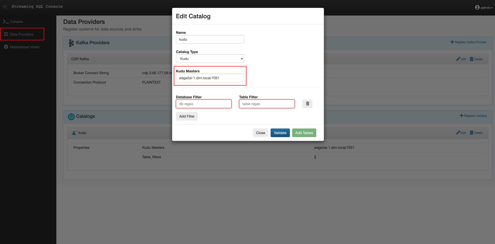
+
. Click *Validate* ->  _Validation was successful, 2 tables found_
. Click *Add Tables*
. Kudu tables are show up now as virtual tables
+
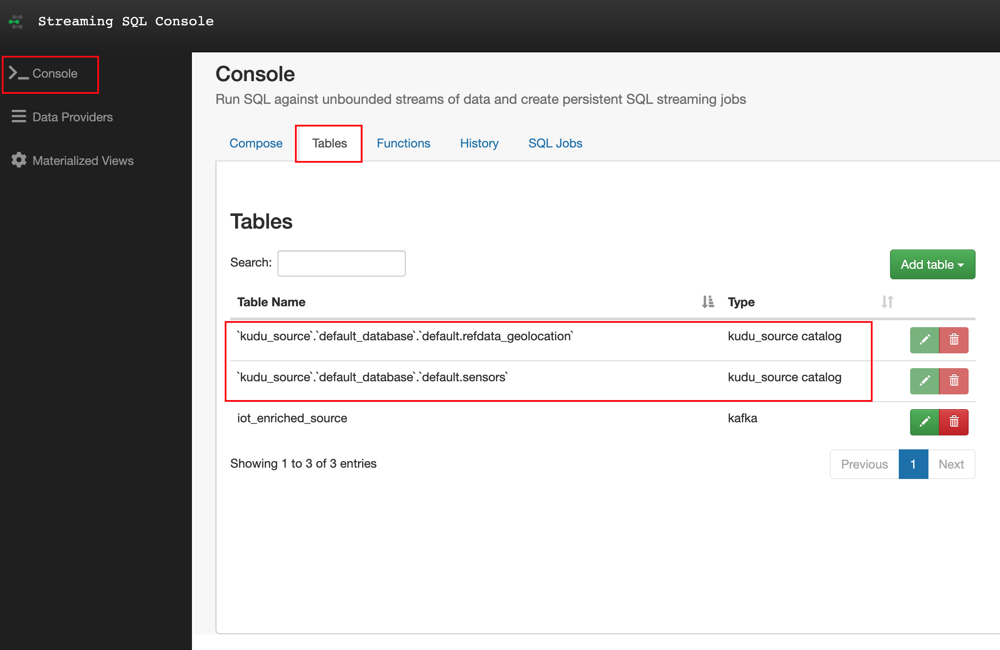
+
. Click on a kudu table and see the schema (DLL) of the table
+
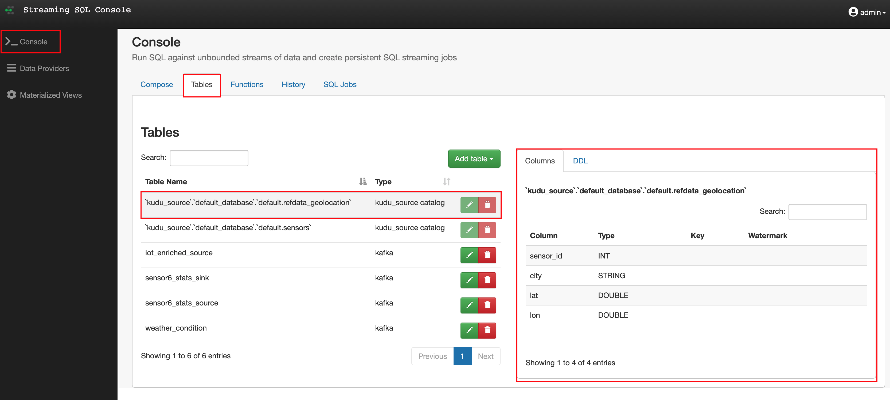
+
. Back to the Console - add a standard SQL lookup
+
[source,sql]
----
select iot.sensor_id,
 sensor_0 as pressure,
 sensor_1 as torsion,
 city,
 lat,
 lon
from iot_enriched_source as iot, `kudu_source`.`default_database`.`default.refdata_geolocation` as refdata
where iot.sensor_id = refdata.sensor_id
----

[[lab_8, Lab 8]]
== Lab 8 - Materialized Views
*Materialized Views* are in synchronization with the mutating stream - they are updated by a primary key as data flows through the system. The data is updated by a given key, and it represents the latest view of the data by key.

. With the SQL from the last lab still running click in the *Console* on *Materialized Views*
+
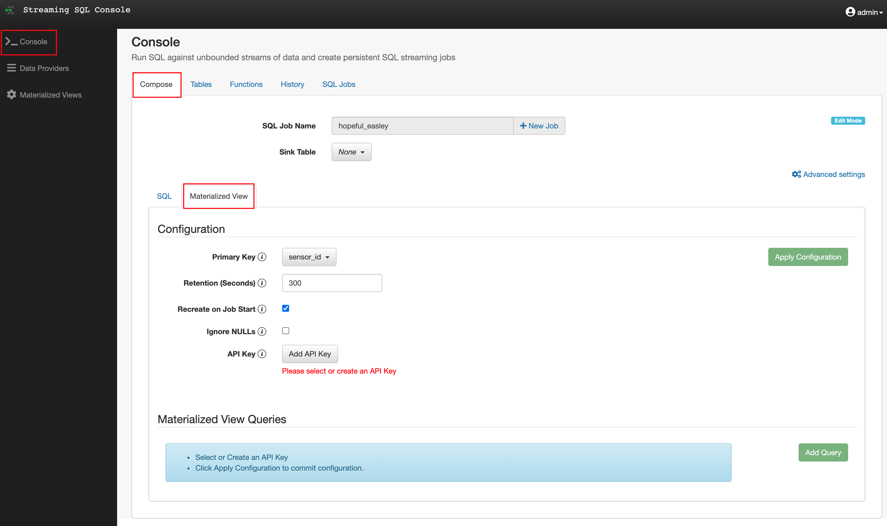
+
. Configuration and *Apply Configuration*
+
[source,shell]
----
Primary Key            sensor_id
Retention (Seconds)    300
Recreate on Job Start  Y
Ignore NULLs           N
API Key                <create API key>
----
+
. Click *Add Query* to provide a URI name and select the attributes in the Materialized View
. Click *Add filters* to apply computations and further enrichment of your data
.. Defining *parameters* for the filter criteria in the URI like /api/v1/query/5195/sensorid/*{sensor_id}*
.. Use the defiled  *parameters* in the filter statement like a normal SQL WHERE clause
+
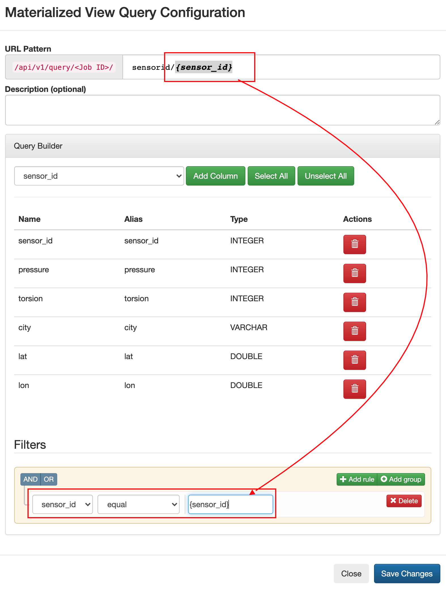
+
.. REST endpoint is exposed as: <URI>/api/v1/query/<job id>/sensorid/*{sensor_id}*?key=<API Key>
.. invoke it with: sample /api/v1/query/5195/sensorid/*12*?key=AbzRvs....

== End of the _Streaming SQL_ Lab's (for today)

